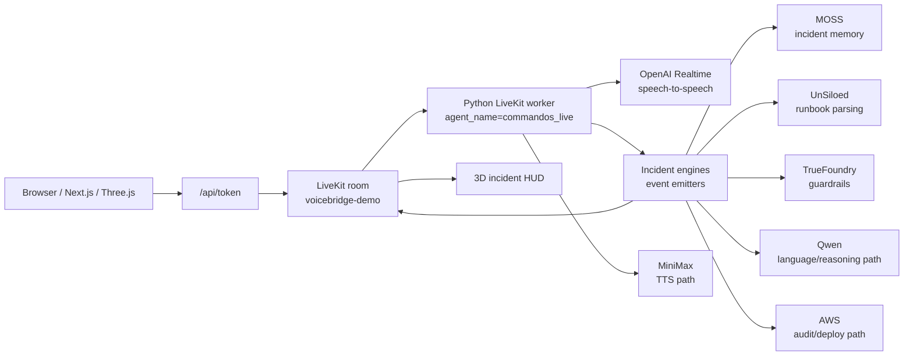

# CommandOS

> A voice-native agentic OS that helps businesses command complexity: visualize risk, guide decisions, and build live command centers.


CommandOS is a voice-first operating surface for business incidents. Instead of opening static dashboards and searching through runbooks, an operator talks to a live agentic OS. The system listens, asks clarifying questions, recalls prior incidents, builds a 3D risk model, blocks unsafe actions, and turns the conversation into a command center, dashboard, and report.

The current demo is a fintech incident for **AtlasPay**: premium customers in Texas are seeing payment failures. CommandOS starts as an orb, joins a LiveKit room, listens through the microphone, and opens the incident HUD only when the operator asks for an incident workflow. The old insurance claim story is no longer the product direction.

## Contents

- [Why It Matters](#why-it-matters)
- [Demo Flow](#demo-flow)
- [What Works Now](#what-works-now)
- [Architecture](#architecture)
- [Sponsor Usage](#sponsor-usage)
- [Pages And States](#pages-and-states)
- [Quick Start](#quick-start)
- [Environment](#environment)
- [Verification](#verification)
- [Known Gaps](#known-gaps)
- [Repository Map](#repository-map)
- [Contributing Invariants](#contributing-invariants)
- [License](#license)

## Why It Matters

Most business software still assumes humans should adapt to dashboards: open the right screen, know the right metric, read the right runbook, then coordinate the right action. CommandOS flips that. The business speaks naturally, and the OS builds the workspace around the decision.

That makes the startup angle sharper:

- **Decision speed:** teams ask questions in plain language and get a live risk map instead of manually assembling context.
- **Operational memory:** MOSS recall changes recommendations based on what worked or failed last time.
- **Governed action:** risky actions are blocked until the system has evidence, policy, and approval.
- **Generated command centers:** the final artifact is not a transcript; it is a reusable operating surface with timeline, mitigation, customer update, and report.

This is not a personal assistant and not a voice wrapper around a dashboard. It is a business command center that is built by conversation.

## Demo Flow

The expected live path is:

1. Operator lands on `/` and sees the 3D orb.
2. Operator clicks **Voice OS**. The browser joins `voicebridge-demo`, publishes the mic track, and dispatches the LiveKit worker.
3. The agent joins as `commandos_live` and the UI shows `Listening`.
4. MOSS memory preloads silently. It does not open the incident HUD by itself.
5. Operator asks: "CommandOS, why are payments failing?"
6. The agent asks for missing scope, then emits incident events over the LiveKit data channel.
7. The HUD opens from real incident-shaping events such as `incident.started`, `map.hotspots`, `topology.built`, and `guardrail.checked`.
8. The system visualizes Texas risk, localizes the payment-flow failure, recalls the prior incident, blocks an unsafe restart, and generates the dashboard/report.

The text input remains available for controlled demo prompts, but the product posture is voice-first. The incident HUD now has a microphone toggle directly beside the text input so the operator can talk or type from the same control bar.

## What Works Now

Implemented and verified locally:

| Surface | Status | Evidence |
| --- | --- | --- |
| 3D landing | Working | Three.js orb/tunnel on `/` |
| Voice activation | Working | Browser connects to LiveKit and publishes mic |
| Live agent dispatch | Working | Worker registered as `commandos_live`; room has `ayush_demo` plus agent participant |
| Silent MOSS preload | Working | `memory.recalled` emits without opening HUD |
| HUD gating | Working | HUD opens only after incident/action events, not on generic memory or scene preload |
| Live HUD controls | Working | Scripted `Next` / `Auto` controls are hidden in live mode |
| Mic in HUD input bar | Working | Bottom conversation bar has a mic toggle beside text input |
| CommandOS scope | Working | New token and agent metadata use `atlaspay` / `sev1_tx_payments_2026_06_07` |

Current live LLM path:

- Default live voice mode uses **OpenAI Realtime** through `COMMANDOS_MODEL_FALLBACK_API_KEY` and `COMMANDOS_MODEL_FALLBACK_REALTIME_MODEL`.
- `COMMANDOS_REALTIME=0` rolls back to the legacy STT -> LLM -> TTS pipeline.
- MiniMax, ElevenLabs, Qwen, and NVIDIA are still represented as provider paths/readiness probes, but they are not all the active live-room LLM at the same time.

## Architecture



The important architectural decision is that the frontend does not hardcode the incident story in live mode. It listens to typed contract events over the LiveKit data channel. The backend emits `call.started`, `call.agent_joined`, `call.audio_ready`, `memory.recalled`, `incident.started`, `map.hotspots`, `topology.built`, `guardrail.checked`, and later dashboard/report events.

## Sponsor Usage

Last local readiness run: **June 7, 2026**, using:

```powershell
pnpm agent:live-check
```

Result: the project has real live paths for the core voice session, OpenAI fallback models, ElevenLabs, NVIDIA, UnSiloed, and MOSS. Strict judged readiness is still blocked by MiniMax balance, Qwen env, TrueFoundry env, AWS env, real payment telemetry, and fixture-backed commandos flow.

| Sponsor / Provider | How It Is Used | Current Truth |
| --- | --- | --- |
| **LiveKit** | Real-time room, browser microphone, agent dispatch, audio transport, and data-channel events. `/api/token` creates the room token and dispatches `commandos_live`. | Live probe passed. Browser verified connected to `voicebridge-demo` and published mic. |
| **MOSS** | Core memory layer for prior incident recall and learning writeback. The live mic loop preloads incident memory silently, then later memory can change mitigation. | Live probe passed: index loaded/queried and learning doc written. Runtime fallback exists if MOSS fails. |
| **UnSiloed AI** | Parses unstructured runbooks and incident docs into operational knowledge that can become `knowledge.retrieved`. | Live probe passed with a real PDF parse. The scripted `commandos_flow` still uses a local-backed knowledge event until live runbook retrieval is fully wired into the incident path. |
| **TrueFoundry** | Intended AI gateway and risky-action guardrail layer. It should block restart until queue depth and approval are present. | Local TrueFoundry-shaped guardrail exists. Live readiness blocked because gateway credentials/base URL/model are missing. |
| **AWS** | Intended deployment, audit, event store, and report packet storage path. | Local audit/event fallback exists. Live readiness blocked because AWS credentials are missing. |
| **MiniMax** | Low-latency sponsor TTS path implemented as a custom streaming adapter compatible with LiveKit Agents 1.5.x. | Configured, but live probe failed with insufficient MiniMax balance. |
| **Qwen / Alibaba** | Multilingual and reasoning path for language-aware summaries and mid-call language switches. | Adapter seam exists. Live readiness blocked because `DASHSCOPE_API_KEY` or `QWEN_BASE_URL` is missing. |
| **ElevenLabs** | Reliable low-latency TTS readiness path and legacy voice fallback. | Live probe passed with real PCM audio. |
| **NVIDIA Nemotron** | OpenAI-compatible reasoning probe path for model fallback/readiness. | Live probe passed with `nvidia/llama-3.3-nemotron-super-49b-v1`. |
| **OpenAI Realtime** | Current active live-room speech-to-speech model when `COMMANDOS_REALTIME=1`. | Live probe passed for realtime client secret and translation model availability. |

Sponsor explanation matters because judges can tell when names are pasted on. In CommandOS, each sponsor owns a different part of the operating loop: LiveKit makes the room real, MOSS makes memory operational, UnSiloed turns documents into policy, TrueFoundry should govern action, AWS should preserve the audit trail, and the model/voice providers make the interaction conversational.

## Pages And States

| Route | Purpose | State |
| --- | --- | --- |
| `/` | Main CommandOS experience. Starts as orb/portal, activates mic, and overlays the live incident HUD only after incident events. | Primary demo route |
| `/incident` | Standalone incident HUD/demo surface. Useful for visual design and offline playback. | Development/demo route |
| `/console` | Legacy text/operator console from the earlier VoiceBridge shape. | Secondary; not primary pitch |
| `/portal` | Observer dashboard and sponsor trace surface. | Useful for sponsor proof |

Key UI states:

- `Activate voice`: no room yet.
- `Waiting for agent`: browser joined LiveKit and mic is on, waiting for agent participant.
- `Listening`: browser mic and agent participant are both live.
- Incident HUD: appears only after incident-shaping events, not on silent MOSS preload.

## Quick Start

Prerequisites:

- Node.js 20+
- pnpm 10.15+
- Python 3.10 through 3.14
- `uv`
- A populated `.env` based on `.env.example`

Install and build:

```powershell
pnpm install
pnpm --filter @voicebridge/contracts build
pnpm agent:setup
```

Run the web app:

```powershell
pnpm dev
```

Run the stable demo worker in another terminal:

```powershell
cd agent
uv run python -m voicebridge_agent.agent start
```

Open:

```text
http://localhost:3000/
```

Click **Voice OS**. The expected healthy state is `Listening`, not an immediate incident dashboard.

## Environment

`.env` is ignored by git. Do not commit secrets.

Important variables:

| Variable | Purpose |
| --- | --- |
| `LIVEKIT_URL`, `LIVEKIT_API_KEY`, `LIVEKIT_API_SECRET` | Required for browser room + agent dispatch |
| `COMMANDOS_AGENT_NAME` | Agent dispatch name; defaults to `commandos_live` |
| `COMMANDOS_REALTIME` | Defaults to realtime voice path; set `0` for legacy STT/LLM/TTS |
| `COMMANDOS_MODEL_FALLBACK_API_KEY` | Current OpenAI-compatible fallback key used by realtime/text probes |
| `COMMANDOS_MODEL_FALLBACK_REALTIME_MODEL` | Realtime model, currently expected as `gpt-realtime-2` |
| `ELEVENLABS_API_KEY`, `ELEVENLABS_VOICE_ID` | ElevenLabs voice readiness/fallback |
| `MINIMAX_API_KEY` | MiniMax TTS path |
| `MOSS_PROJECT_ID`, `MOSS_PROJECT_KEY` | MOSS live memory |
| `UNSILOED_API_KEY`, `UNSILOED_PARSE_URL` | UnSiloed live document parsing |
| `TRUEFOUNDRY_API_KEY`, `TRUEFOUNDRY_GATEWAY_BASE_URL`, `TRUEFOUNDRY_MODEL` | TrueFoundry live guardrail/model gateway |
| `DASHSCOPE_API_KEY`, `QWEN_BASE_URL`, `QWEN_MODEL` | Qwen live multilingual path |
| `AWS_ACCESS_KEY_ID`, `AWS_SECRET_ACCESS_KEY`, `AWS_REGION` | AWS audit/deployment readiness |
| `COMMANDOS_PAYMENTS_API_URL` | Real payment telemetry for the live map |

## Verification

Focused checks used for the current implementation:

```powershell
cd agent
uv run ruff check voicebridge_agent/agent.py voicebridge_agent/incident_engines.py tests/test_agent_runtime.py
uv run pytest tests/test_agent_runtime.py tests/test_voice.py
```

```powershell
pnpm --filter @voicebridge/web exec eslint src/components/CommandOSLanding.tsx src/components/IncidentHUD.tsx src/app/api/token/route.ts
pnpm --filter @voicebridge/contracts build
pnpm agent:live-check
```

Browser verification performed locally:

- Fresh `/` page showed only the landing orb and `Activate voice`.
- After clicking **Voice OS**, the page showed `Voice OS - Listening`.
- The room contained `ayush_demo` and one `agent-*` participant dispatched through `commandos_live`.
- The old `home_claim_H-48291` metadata was removed from new user/agent dispatches.
- No incident HUD opened before operator intent.

## Known Gaps

These are blockers before claiming a strict judged live demo:

- MiniMax account balance needs to be fixed for live MiniMax TTS.
- Qwen/DashScope env needs to be completed.
- TrueFoundry gateway credentials/model need to be configured.
- AWS credentials/audit target need to be configured.
- `COMMANDOS_PAYMENTS_API_URL` must return real recent payment-failure telemetry.
- The deterministic `commandos_flow` still contains local/fixture-backed events; strict readiness fails until every sponsor-facing event is backed by a real provider call.

## Repository Map

| Path | Role |
| --- | --- |
| `web/` | Next.js app, 3D landing, incident HUD, token route, portal/console surfaces |
| `agent/` | Python LiveKit worker, OpenAI Realtime/legacy voice paths, provider readiness |
| `brain/` | CommandOS incident orchestration, local sponsor-shaped fallbacks, MOSS/knowledge/guardrail seams |
| `contracts/` | Shared event envelope and TypeScript/Python mirrors |
| `spec.md` | Product spec and sponsor-fit rationale |
| `DEMO_SCRIPT.md` | Live demo runbook and strict-readiness rule |
| `tasks.md` | Parallel agent task plan |
| `.env.example` | Public environment template |

## Contributing Invariants

- Do not open the incident HUD from silent preload events.
- Do not claim a sponsor is live unless `pnpm agent:live-check` proves the real provider call.
- Do not execute or imply execution of risky infrastructure actions from the demo.
- Keep all frontend incident state driven by contract events, not hardcoded live UI state.
- Keep CommandOS scope as `atlaspay`, `ayush_demo`, `sev1_tx_payments_2026_06_07`.
- Keep secrets out of git and logs.

## License

No license file is currently checked in.
